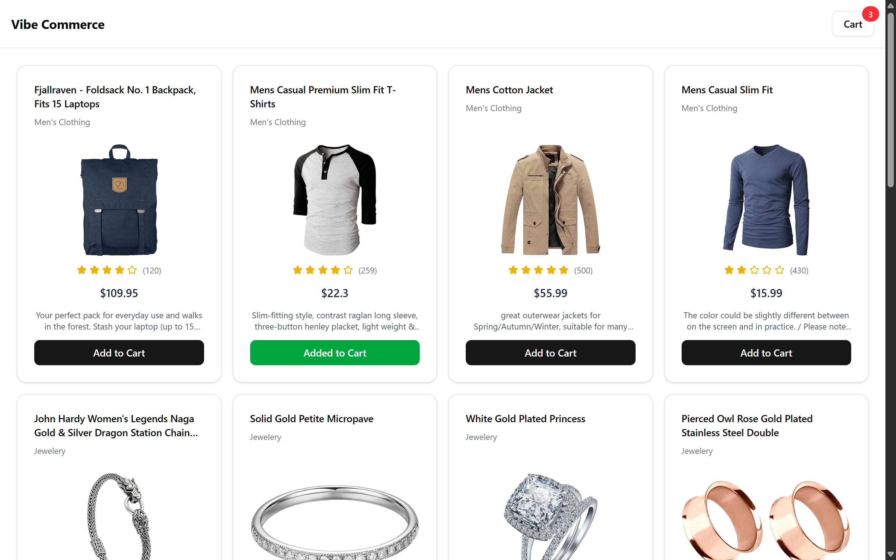
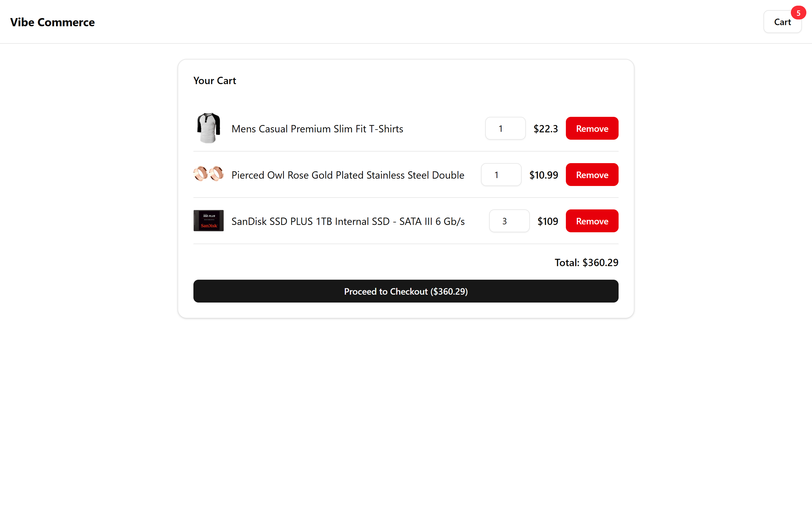
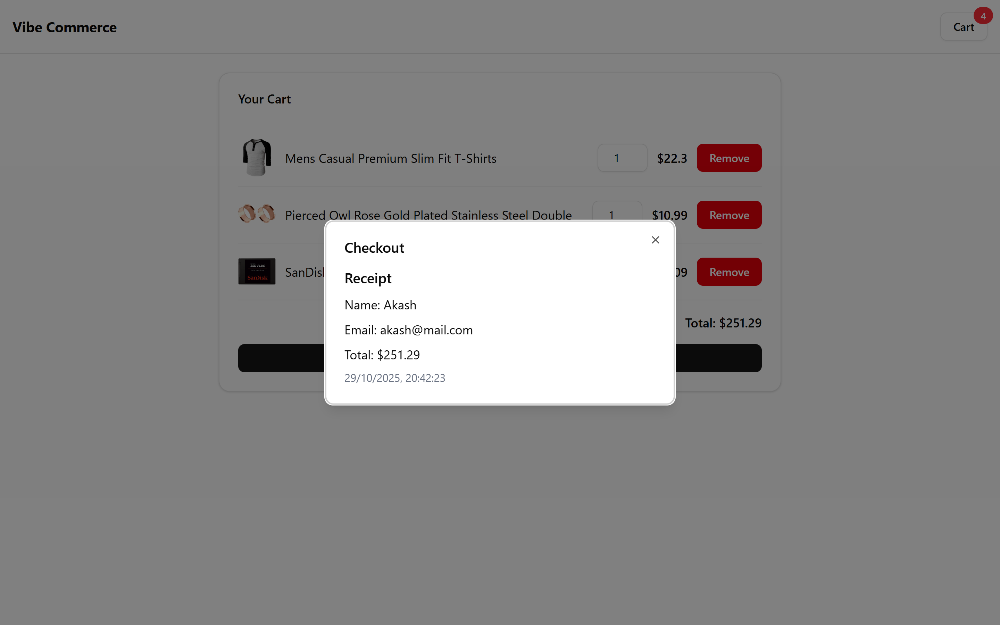

# 🛍️ Vibe Commerce – Mock E-Commerce Cart

A simple full-stack shopping cart app built as part of the Vibe Commerce internship screening.  
Users can browse products, add/remove items from the cart, and complete a mock checkout — all with a clean React UI and a Node/Express backend.

---

## 🚀 Tech Stack

**Frontend:** React (Vite) + TypeScript + shadcn/ui  
**Backend:** Node.js + Express + TypeScript  
**Database:** MongoDB (optional for persistence)  
**API:** REST (mock + Fake Store API)

---

## 📁 Folder Structure

```

.
├── backend/            # Express + TypeScript API
│   ├── src/
│   │   ├── routes/     # Product, Cart, Checkout routes
│   │   ├── models/     # MongoDB models
│   │   ├── server.ts   # Express app entry
│   │   └── config/     # DB setup
│   └── package.json
│
├── frontend/           # React + Vite + shadcn UI
│   ├── src/
│   │   ├── pages/      # Home, Cart
│   │   ├── components/ # ProductCard, CartItem, CheckoutModal
│   │   ├── context/    # CartContext (global state)
│   │   ├── api/        # Axios API calls
│   │   └── App.tsx
│   └── package.json
│
└── README.md

````

---

## ⚙️ Setup Instructions

### 1. Clone the Repository
```bash
git clone https://github.com/akashgupta157/vibe-commerce-assignment.git
cd vibe-commerce-assignment
````

### 2. Install Dependencies

#### Backend

```bash
cd backend
npm install
```

#### Frontend

```bash
cd ../frontend
npm install
```

---

## 🧩 Running the App

### Backend

```bash
npm run dev
```

The API will start at:
👉 `http://localhost:5000`

### Frontend

```bash
npm run dev
```

The app will be available at:
👉 `http://localhost:5173`

---

## 🧠 Features

- ✅ Product grid fetched from [Fake Store API](https://fakestoreapi.com/)
- ✅ Add / remove items from cart
- ✅ View cart total and quantities
- ✅ Checkout form with mock receipt
- ✅ Responsive UI with shadcn components
- ✅ Toast notifications for order confirmation
- ✅ (Bonus) MongoDB persistence support

---

## 📸 Screenshots

| Home Page                     | Cart Page                     | Checkout Modal                        |
| ----------------------------- | ----------------------------- | ------------------------------------- |
|  |  |  |

---

## 🧾 API Endpoints

### Products

* `GET /api/products` → Fetch list of products

### Cart

* `POST /api/cart` → Add item
* `GET /api/cart` → Get cart items and total
* `DELETE /api/cart/:id` → Remove item

### Checkout

* `POST /api/checkout` → Generate mock receipt

---

## 🎥 Demo Video

👉 [Demo Video](https://www.loom.com/share/b1271e8e918a4e6ca8e66503b6421132)

---

## 💡 Notes

* The app doesn’t process real payments — it’s a mock checkout.
* You can replace the Fake Store API with your own product data if needed.
* Backend and frontend run independently; no hosting required.

---

## 👤 Author

**Akash Gupta**
- 📧 [Email](mailto:akashgupta989322@gmail.com)
- 🌐 [GitHub Profile](https://github.com/akashgupta157)
- 🌐 [Portfolio Website](https://akashgupta157.vercel.app)
